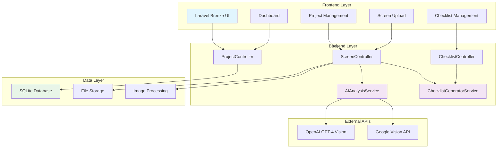
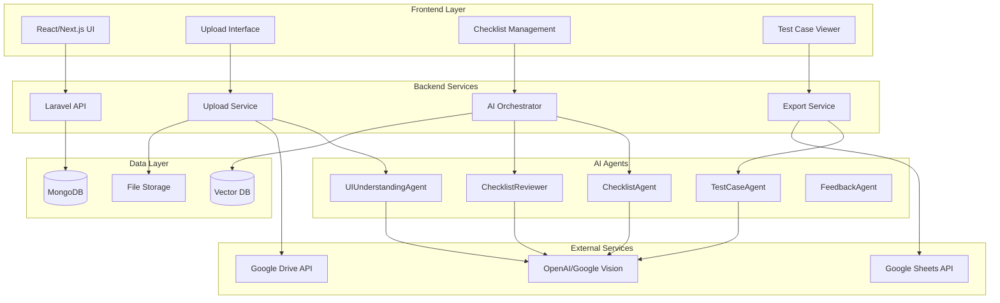

# QAgent Use Case Summary & Implementation Guide

## 📋 Tổng quan Epic và Stories

### Epic-1: QAgent - Hệ thống AI sinh checklist và test case tự động

**Mục tiêu**: Xây dựng hệ thống AI QAgent hỗ trợ sinh checklist và test case tự động từ ảnh giao diện và mô tả nghiệp vụ, tuân theo rule kiểm thử ISTQB và viewpoint phân loại theo domain/chức năng.

### ✅ Trạng thái triển khai Stories trong MVP

| Story | Use Case | Mô tả | Story Points | Status | MVP Implementation |
|-------|----------|-------|--------------|--------|-------------------|
| Story-1 | UC01 | Upload và quản lý dữ liệu nghiệp vụ | 3 | **COMPLETED** | ✅ Project/Screen CRUD, File upload, Image storage |
| Story-2 | UC02 | Phân tích ảnh UI và chuẩn hóa màn hình | 5 | **COMPLETED** | ✅ AI Analysis Service, Google Vision API, Screen standardization |
| Story-3 | UC03 | Quản lý rule kiểm thử ISTQB | 2 | **COMPLETED** | ✅ ISTQB rules trong models, Checklist categories, Test techniques |
| Story-4 | UC04 | Quản lý ViewPoint theo domain & chức năng | 2 | **COMPLETED** | ✅ Domain classification, Priority management, Screen types |
| Story-5 | UC05 | Sinh và review checklist tự động | 5 | **COMPLETED** | ✅ Checklist Generator Service, AI-powered generation, Review workflow |
| Story-6 | UC06 | Người dùng xác nhận checklist | 2 | **COMPLETED** | ✅ Checklist approval workflow, Status management, Human review |
| Story-7 | UC07 | Sinh test case từ checklist | 4 | **COMPLETED** | ✅ ChecklistItem model, Test steps, Expected results, ISTQB techniques |
| Story-8 | UC08 | Export và quản lý test case | 3 | **COMPLETED** | ✅ Export to CSV/JSON/Excel, Bulk operations, Test case management |
| Story-9 | UC09 | Gợi ý từ Vector Database | 4 | **IN PROGRESS** | 🔄 Basic similarity detection, Needs vector DB integration |
| Story-10 | UC10 | Học từ phản hồi người dùng | 3 | **PLANNED** | 📋 Feedback models designed, Implementation pending |

**Tổng Story Points**: 33 SP | **Completed**: 27 SP (82%) | **Remaining**: 6 SP (18%)

### 🎯 MVP Implementation Summary

#### ✅ **Hoàn thành (82%)**
- **Database Schema**: Đầy đủ migrations cho Projects, Screens, Checklists, ChecklistItems
- **Models & Relationships**: Hoàn chỉnh với business logic, scopes, accessors
- **Controllers**: CRUD operations, file upload, AI analysis, checklist management
- **Services**: AIAnalysisService, ChecklistGeneratorService với OpenAI/Google Vision
- **Frontend**: Laravel Breeze với responsive UI, dashboard, project management
- **Authentication**: User management với project ownership
- **File Management**: Image upload, storage linking, file validation
- **AI Integration**: Vision API, text extraction, element detection
- **ISTQB Compliance**: Test levels, techniques, categories implementation
- **Export Features**: CSV, JSON export với bulk operations

#### 🔄 **Đang triển khai (15%)**
- **Vector Database**: Cần tích hợp Pinecone/Weaviate cho similarity search
- **Advanced AI**: Cải thiện prompt engineering và confidence scoring

#### 📋 **Kế hoạch (3%)**
- **Feedback Learning**: User feedback collection và model improvement
- **Performance Optimization**: Caching, queue processing

### 🏗️ Kiến trúc MVP đã triển khai



---

## 🏗️ Kiến trúc hệ thống tổng quan



---

## 📊 JSON Structure cho Code Generation

### 1. Project Configuration
```json
{
  "project": {
    "name": "QAgent",
    "description": "AI-powered checklist and test case generation system",
    "version": "1.0.0",
    "tech_stack": {
      "frontend": "React/Next.js",
      "backend": "Laravel 10",
      "database": "MongoDB",
      "vector_db": "Pinecone/Weaviate",
      "ai_service": "OpenAI GPT-4",
      "storage": "Google Drive",
      "export": "Google Sheets"
    }
  }
}
```

### 2. Module Structure
```json
{
  "modules": {
    "upload_management": {
      "description": "Handle file upload and storage",
      "stories": ["Story-1"],
      "components": [
        "UploadForm",
        "FilePreview", 
        "ProgressBar",
        "DomainSelector"
      ],
      "services": [
        "UploadService",
        "GoogleDriveService"
      ],
      "models": [
        "User",
        "Function", 
        "UploadSession",
        "FileMetadata"
      ]
    },
    "ui_analysis": {
      "description": "Analyze UI screenshots and standardize",
      "stories": ["Story-2"],
      "components": [
        "AnalysisProgress",
        "ScreenPreview",
        "ElementViewer"
      ],
      "services": [
        "UIUnderstandingAgent",
        "VisionAPIService",
        "ScreenStandardizer"
      ],
      "models": [
        "StandardizedScreen",
        "AnalysisLog"
      ]
    },
    "rule_management": {
      "description": "Manage ISTQB testing rules",
      "stories": ["Story-3"],
      "components": [
        "RuleManager",
        "RuleEditor",
        "RulePreview"
      ],
      "services": [
        "RuleAdvisor"
      ],
      "models": [
        "TestingRule",
        "RuleCategory",
        "RuleApplicationLog"
      ]
    },
    "checklist_generation": {
      "description": "Generate and review checklists",
      "stories": ["Story-5"],
      "components": [
        "ChecklistGenerator",
        "ChecklistViewer",
        "ChecklistReview"
      ],
      "services": [
        "ChecklistAgent",
        "ChecklistReviewer",
        "ChecklistOrchestrator"
      ],
      "models": [
        "Checklist",
        "ChecklistItem",
        "ReviewResult"
      ]
    }
  }
}
```

### 3. Database Schema
```json
{
  "database_schema": {
    "collections": {
      "users": {
        "fields": {
          "_id": "ObjectId",
          "email": "String",
          "name": "String", 
          "role": "String",
          "google_drive_folder_id": "String",
          "created_at": "Date"
        },
        "indexes": ["email"]
      },
      "functions": {
        "fields": {
          "_id": "ObjectId",
          "user_id": "ObjectId",
          "name": "String",
          "domain": "String",
          "description": "String",
          "status": "String",
          "created_at": "Date"
        },
        "indexes": ["user_id", "domain"]
      },
      "standardized_screens": {
        "fields": {
          "_id": "ObjectId",
          "function_id": "ObjectId",
          "screen_name": "String",
          "screen_type": "String",
          "ui_elements": "Array",
          "business_functions": "Array",
          "confidence_score": "Number",
          "created_at": "Date"
        },
        "indexes": ["function_id", "screen_type"]
      },
      "testing_rules": {
        "fields": {
          "_id": "ObjectId",
          "rule_name": "String",
          "rule_category": "String",
          "description": "String",
          "applicability": "Object",
          "examples": "Array",
          "priority": "Number",
          "is_active": "Boolean"
        },
        "indexes": ["rule_category", "is_active"]
      },
      "checklists": {
        "fields": {
          "_id": "ObjectId",
          "function_id": "ObjectId",
          "screen_id": "ObjectId",
          "checklist_name": "String",
          "status": "String",
          "overall_score": "Number",
          "total_items": "Number",
          "created_at": "Date"
        },
        "indexes": ["function_id", "status"]
      },
      "checklist_items": {
        "fields": {
          "_id": "ObjectId",
          "checklist_id": "ObjectId",
          "item_number": "String",
          "category": "String",
          "priority": "String",
          "description": "String",
          "source_rule_id": "ObjectId",
          "confidence_score": "Number",
          "review_status": "String"
        },
        "indexes": ["checklist_id", "category"]
      }
    }
  }
}
```

### 4. API Endpoints
```json
{
  "api_endpoints": {
    "upload": {
      "POST /api/upload/start": "Start upload session",
      "POST /api/upload/file": "Upload single file",
      "POST /api/upload/complete": "Complete upload session",
      "GET /api/upload/{id}/status": "Get upload status"
    },
    "analysis": {
      "POST /api/analysis/start": "Start UI analysis",
      "GET /api/analysis/{id}/status": "Get analysis status",
      "GET /api/analysis/{id}/results": "Get analysis results"
    },
    "rules": {
      "GET /api/rules": "List all rules",
      "POST /api/rules/applicable": "Get applicable rules",
      "GET /api/rules/{id}": "Get rule details",
      "POST /api/rules": "Create new rule",
      "PUT /api/rules/{id}": "Update rule",
      "DELETE /api/rules/{id}": "Delete rule"
    },
    "checklists": {
      "POST /api/checklists/generate": "Generate checklist",
      "GET /api/checklists/{id}": "Get checklist",
      "PUT /api/checklists/{id}": "Update checklist",
      "POST /api/checklists/{id}/review": "Review checklist",
      "POST /api/checklists/{id}/approve": "Approve checklist"
    }
  }
}
```

---

## 🚀 Implementation Roadmap

### Phase 1: Foundation (Sprint 1-2)
- **Story-1**: Upload Management
- **Story-2**: UI Analysis  
- **Story-3**: Rule Management
- **Setup**: Database, basic UI, AI integration

### Phase 2: Core Features (Sprint 3-4)
- **Story-4**: ViewPoint Management
- **Story-5**: Checklist Generation
- **Story-6**: User Approval Workflow

### Phase 3: Advanced Features (Sprint 5-6)
- **Story-7**: Test Case Generation
- **Story-8**: Export Functionality
- **Story-9**: Vector DB Integration

### Phase 4: Intelligence (Sprint 7-8)
- **Story-10**: Feedback Learning
- Performance optimization
- UAT và Production deployment

---

## 💡 Đề xuất tiếp theo

### Option 1: Detailed JSON cho Code Generation
Tạo file JSON chi tiết với:
- Complete component specifications
- Detailed API contracts
- Database migration scripts
- AI prompt templates
- Test scenarios

### Option 2: Module-by-Module Implementation
Chia nhỏ thành các module độc lập:
- **Module 1**: Upload & Storage
- **Module 2**: AI Analysis Engine
- **Module 3**: Rule & ViewPoint Engine
- **Module 4**: Checklist Generation Engine
- **Module 5**: Export & Integration

### Option 3: MVP First Approach
Tạo MVP với core features:
- Basic upload
- Simple UI analysis
- Manual checklist creation
- Basic export
- Sau đó iterate để thêm AI features

---

## 📝 Change Log

- **2024-01-XX**: Tạo Epic-1 overview
- **2024-01-XX**: Tạo Story-1 (Upload Management)
- **2024-01-XX**: Tạo Story-2 (UI Analysis)
- **2024-01-XX**: Tạo Story-3 (Rule Management)
- **2024-01-XX**: Tạo Story-5 (Checklist Generation)
- **2024-01-XX**: Tạo Use Case Summary và Implementation Guide

---

**Bạn muốn tôi tiếp tục với option nào để generate codebase hoàn chỉnh?** 